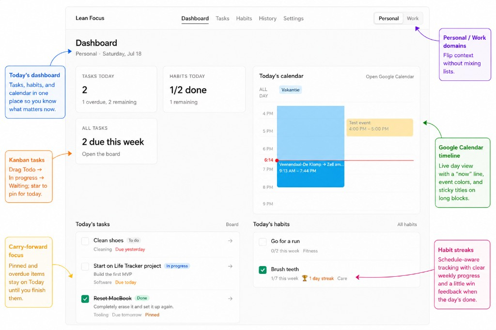

# Stead

Keep the day steady — tasks, habits, and calendar in one calm dashboard.

**Beta:** [steadapp.vercel.app](https://steadapp.vercel.app)



## Features

- **Dashboard** — today’s tasks (pinned / due / overdue), habits, and a Google Calendar day timeline
- **Tasks** — Kanban (To do / In progress / Waiting), pin for today, soft-delete
- **Habits** — daily or weekly schedules, check-offs, streaks
- **Domains** — separate Personal / Work (and custom domains) without mixing lists
- **Auth** — Google sign-in via Supabase Auth

## Stack

- Vite + React + TypeScript + Tailwind
- Supabase (Auth, Postgres + RLS, one Edge Function for Calendar token refresh)

## Setup

### 1. Clone and install

```bash
npm install
cp .env.example .env.local
```

Set in `.env.local`:

```
VITE_SUPABASE_URL=https://YOUR_PROJECT.supabase.co
VITE_SUPABASE_ANON_KEY=your-anon-key
```

Never commit `.env` / `.env.local`. Never put `GOOGLE_CLIENT_SECRET` or the Supabase **service role** key in Vite env.

### 2. Database

Create a Supabase project and apply SQL in `supabase/migrations/` (SQL Editor or `supabase db push`), in timestamp order.

### 3. Google sign-in

1. [Google Cloud Console](https://console.cloud.google.com/) → OAuth 2.0 Web client
2. Authorized redirect URI: `https://YOUR_PROJECT.supabase.co/auth/v1/callback`
3. Supabase → Authentication → Providers → Google → Client ID + Secret
4. Supabase → Authentication → URL Configuration → add:
   - `http://localhost:5173`
   - `http://localhost:5173/settings`
   - your production origin (and `/settings`)

### 4. Google Calendar (optional)

Uses the **same** OAuth client, with incremental consent from Settings (not on every login).

1. Enable **Google Calendar API**
2. OAuth consent screen → add `https://www.googleapis.com/auth/calendar.readonly`  
   (Testing mode + your account as test user is enough for personal use)
3. Deploy the Edge Function and set secrets (same Client ID/Secret as Auth):

```bash
supabase secrets set GOOGLE_CLIENT_ID=your-client-id.apps.googleusercontent.com
supabase secrets set GOOGLE_CLIENT_SECRET=your-client-secret
supabase functions deploy refresh-google-calendar
```

4. Apply the calendar token migrations if not already applied

### 5. Run

```bash
npm run dev
```

## Deploy (Vercel)

1. Push to GitHub and import in Vercel (Vite)
2. Env: `VITE_SUPABASE_URL`, `VITE_SUPABASE_ANON_KEY`
3. Add the production URL to Supabase Auth redirect URLs

## Security notes

- All app tables use **RLS** (`auth.uid() = user_id`)
- Browser only uses the **anon** key; data access is enforced by RLS
- Google **refresh tokens** are stored in Postgres; the browser can write them after OAuth but cannot read them back (column grants). Refresh runs in the Edge Function with the service role
- Short-lived Google **access tokens** are used in the browser to call Calendar API
- Keep the project free of secrets: `.env*` is gitignored (except `.env.example`)

## Scripts

| Command | Description |
|---------|-------------|
| `npm run dev` | Dev server |
| `npm run build` | Typecheck + production build |
| `npm run preview` | Preview production build |
| `npm run lint` | Oxlint |

## License

Add a `LICENSE` file when you publish (e.g. MIT).
